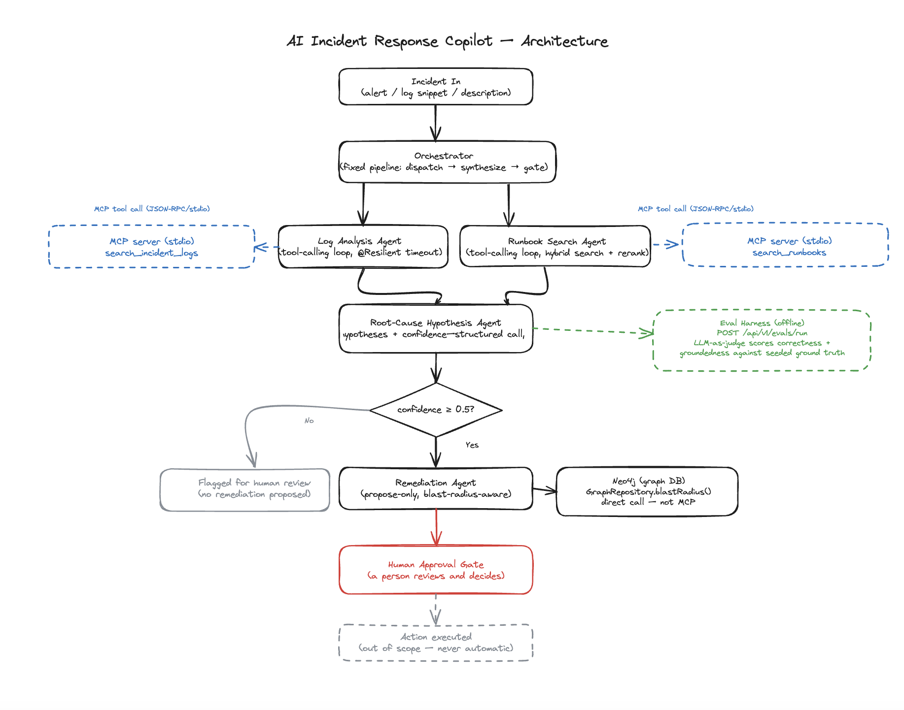
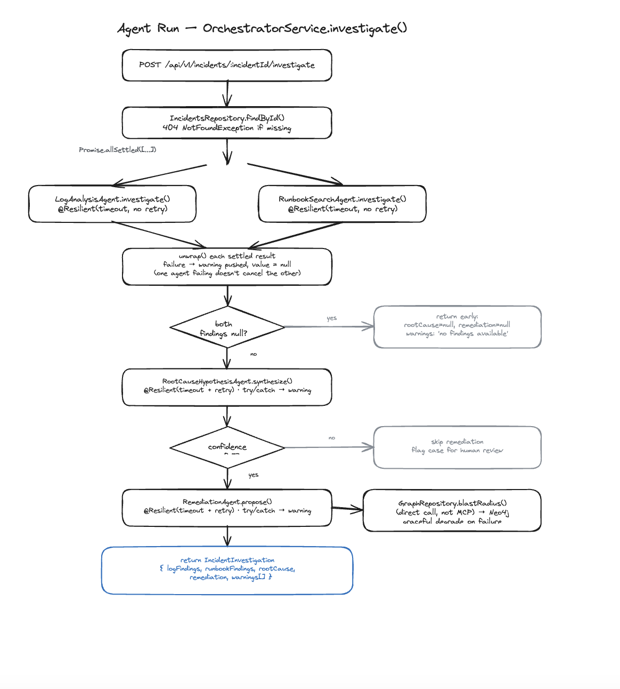
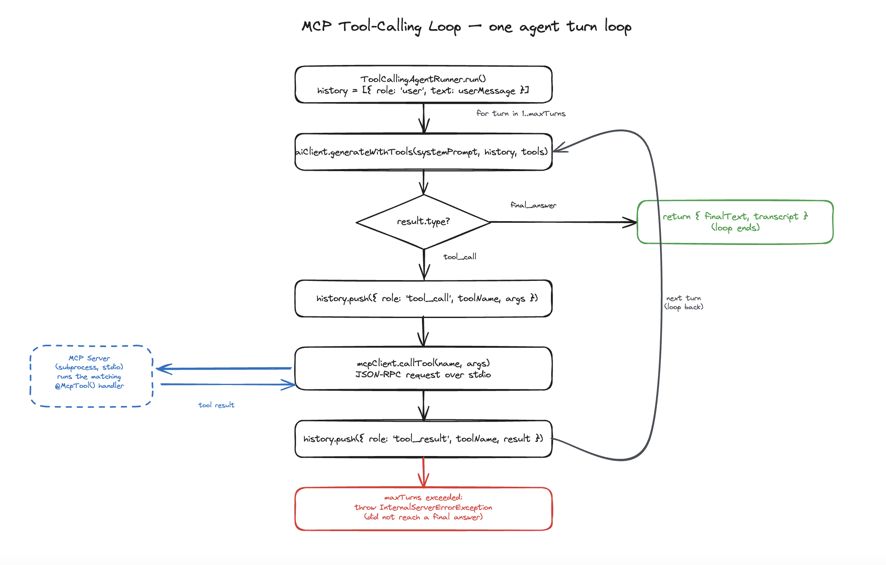
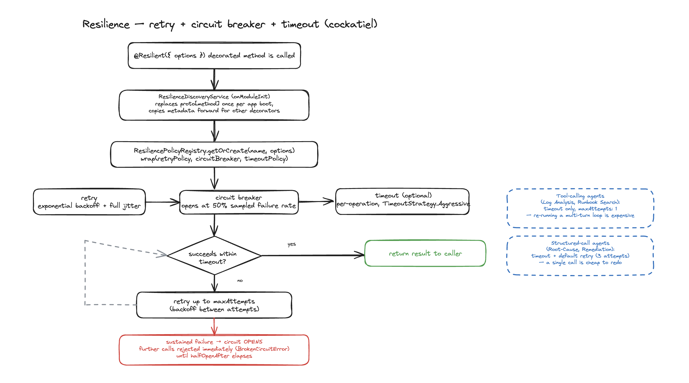
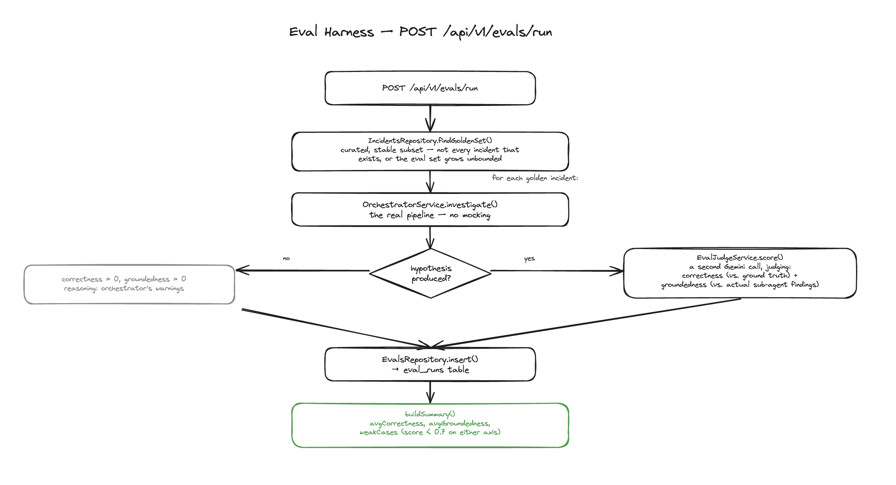

# AI Incident Response Copilot

A multi-agent system that takes an incident — an alert, a log snippet, a short description — and produces an investigated, ranked root-cause hypothesis with a proposed remediation. It's a copilot, not an autonomous actor: it investigates and recommends only — there's no code path anywhere in this project that executes a remediation step, so any real action is entirely up to a human reading the proposal and deciding for themselves.

---

## What it does

1. **Receives** an incident — title, description, service, severity — either pre-recorded or seeded
2. **Investigates** in parallel: a Log Analysis agent searches incident logs, a Runbook Search agent
   searches a knowledge base of prior postmortems — both via real MCP tool servers, both running a
   genuine multi-turn tool-calling loop (search, read results, decide whether to search again)
3. **Synthesizes** both agents' findings into a ranked list of root-cause hypotheses with confidence
   and reasoning
4. **Gates** on that confidence — below threshold, the case is flagged for human review and stops
   there; at or above it, a Remediation agent proposes concrete next steps
5. **Never executes** — every proposed remediation step requires a human to read it and act on it
   themselves
6. **Degrades gracefully** — if a sub-agent fails or times out, the orchestrator reports whatever
   findings it does have and flags what it couldn't determine, instead of failing the whole request
7. **Weighs blast radius** — the Remediation agent looks up the affected service's dependents in a
   Neo4j graph and weighs proposed steps against who else breaks if it stays down
8. **Measures itself** — an LLM-as-judge eval harness scores every seeded incident for correctness
   (did it find the real cause) and groundedness (was its reasoning actually supported by what the
   sub-agents found, not hallucinated)

---

## Architecture



The pipeline is a fixed sequence, not a dynamic planner (that's a deliberate simplification — see
below): dispatch the two investigative agents in parallel, synthesize, gate on confidence, propose
remediation, stop at the human approval boundary.

### Orchestration & Agents



`OrchestratorService.investigate()` drives the whole sequence. The two investigative agents
(`LogAnalysisAgent`, `RunbookSearchAgent`) each run a real tool-calling loop against a Gemini model —
issue a search, read the result, decide whether to broaden, narrow, or reformulate, repeat up to a
turn limit. The two synthesis agents (`RootCauseHypothesisAgent`, `RemediationAgent`) don't have
tools at all — by the time they run, all the evidence they need has already been gathered and handed
to them, so a single structured, Zod-validated call is enough. Mixing both styles in one pipeline,
rather than forcing everything through a loop or everything through one shot, is itself the point:
the litmus test is whether a step needs to reach into an external system and adapt based on what it
finds.

### MCP Tool Layer



Both investigative agents reach their tools through real [MCP](https://modelcontextprotocol.io)
servers over stdio, not direct in-process function calls. `McpClient` is an abstract base class
handling connect-on-boot / close-on-shutdown via Nest's own lifecycle hooks; `LogSearchMcpClient` and
`RunbookSearchMcpClient` each subclass it with nothing but their own spawn config. Both servers are
spawned once at app startup and stay connected for the process's lifetime — not spawned per request.

MCP is the right shape specifically when the _model_ decides whether/when/how to call something —
which is exactly what these two agents do (search, read the result, decide whether to search again).
`RemediationAgent`'s blast-radius lookup below is the opposite case: application code always calls it,
unconditionally, with an argument it already knows — no ambiguity for a model to resolve. That's not a
tool call wearing a protocol costume, it's a repository call, so it's wired as one.

### Runbook Search

`RunbookSearchAgent`'s tool wraps a hybrid search pipeline ported from Phase 1: pgvector cosine
similarity + Postgres full-text search, fused with Reciprocal Rank Fusion, reranked with a local
cross-encoder (`Xenova/ms-marco-MiniLM-L-6-v2`) before the top matches go back to the agent.

### Service Dependency Graph

Service dependencies (`DEPENDS_ON` edges, each tagged `hard`/`soft` criticality) live in Neo4j, queried
through `GraphRepository`. `RemediationAgent` calls `blastRadius(incident.service)` directly — a plain
injected dependency, not an MCP tool (see above) — and splices the result into its prompt, so proposed
remediation steps get weighed against which other services actually depend on the affected one. A
missing or unreachable graph entry degrades gracefully to no blast-radius section rather than failing
the whole proposal — same "tell the truth about what you don't know" discipline as the rest of the
pipeline.

Migrations against Neo4j are tracked the same way Drizzle tracks Postgres migrations — an ordered,
append-only list with a tracking node per applied id — guarded by a hand-rolled distributed lock, since
Neo4j has no native advisory-lock primitive. See
[ADR-002](docs/decisions/002-polyglot-persistence-graph-and-postgres.md) for why the dependency graph
lives in Neo4j rather than Postgres, and how the two stores stay consistent without a distributed
transaction.

### Failure Recovery



`OrchestratorService` dispatches the two investigative agents via `Promise.allSettled`, not
`Promise.all`, so one failing doesn't cancel the other. Every sub-agent's entry point carries a
`@Resilient()` policy (retry + circuit breaker + timeout, via `cockatiel`) — tuned differently per
agent: the tool-calling agents get a timeout with no retry (re-running a whole multi-turn loop from
scratch is expensive), the structured-call agents get a timeout plus the default retry (a single call
is cheap to redo). Any stage that fails becomes a plain-English entry in the response's
`warnings: string[]` rather than a thrown exception; findings, the hypothesis, and the remediation
plan are all nullable — a partial result is a valid response shape, not an error. If the top
hypothesis's confidence falls below the threshold, remediation is skipped outright and the case is
flagged for a human, on the theory that proposing an action on a diagnosis the system itself doesn't
trust is worse than proposing nothing.

### Eval Harness



`POST /api/v1/evals/run` runs the real pipeline against every seeded incident and scores it:

```
POST /api/v1/evals/run
  │
  └─ IncidentsRepository.findGoldenSet()      — a curated, stable subset, not every incident
                                                  that ever exists — an eval set has to stay
                                                  reproducible as the incidents table grows
  │
  └─ For each golden incident:
       ├─ OrchestratorService.investigate()    — the real pipeline, no mocking
       ├─ EvalJudgeService.score()             — a second Gemini call, judging:
       │    ├─ correctness   — does the hypothesis match the known ground truth?
       │    └─ groundedness  — is the reasoning actually supported by what the
       │                        sub-agents found, or invented?
       └─ EvalsRepository.insert()             — persisted to eval_runs
  │
  └─ Return summary: avgCorrectness, avgGroundedness, weakCases (below 0.7)
```

Run before and after any prompt or orchestration change to prove it helped, not just hope it did.

---

## Eval Results

Latest run against all 6 seeded incidents, live against Gemini 3.5 Flash:

| Metric                     | Score    |
| -------------------------- | -------- |
| Cases run                  | 6 / 6    |
| Avg correctness            | **0.96** |
| Avg groundedness           | **1.00** |
| Weak cases (< 0.7)         | 0        |
| Total cost of the full run | $0.03    |

Five of six cases scored a perfect 1.0/1.0 — the pipeline identified the exact seeded root cause
(a missing config env var, a Redis cache-eviction stampede, a missing DB index, an unbounded in-memory
cache OOM) with reasoning fully traceable to what the sub-agents actually found. The one case that
scored lower (0.8 correctness) is instructive: the system correctly identified the external trigger
(a payment gateway provider outage) but missed the deeper architectural root cause the ground truth
emphasizes — a missing circuit breaker letting the outage cascade into thread-pool exhaustion. It
found _a_ cause, not the deepest one — exactly the kind of gap a shallower "did it mention the outage"
check wouldn't have caught.

---

## Example Walkthrough

A real trace from the eval run above — the `payments-oom-crashloop` seeded incident:

**Incident in:**

> Payments API pods crash-looping after v2.14.0 deploy — "pods restarting every 2-3 minutes since the
> 14:02 UTC deploy, checkout success rate down 40%."

**Log Analysis Agent** (tool-calling loop against `search_incident_logs`, several turns narrowing from
a broad query to specific keywords) found: heap usage climbing steadily post-deploy
(412MB → 598MB → 781MB), a `idempotency_cache_size` warning with no eviction configured, then
`OOMKilled` kubelet events and `CrashLoopBackOff`.

**Runbook Search Agent** (tool-calling loop against `search_runbooks`) matched:
_"Runbook: Service OOMKilled / CrashLoopBackOff after a deploy"_ — unbounded in-memory cache growth
as a known failure pattern.

**Root-Cause Hypothesis Agent** (structured call, no tools — synthesizing both findings above):

> **Root cause:** Unbounded in-memory idempotency cache introduced in v2.14.0 leading to JVM memory
> leak and OOM-Kill
> **Reasoning:** _"...accurately identifying the unbounded in-memory idempotency cache introduced in
> v2.14.0 with no eviction policy as the source of the memory leak and subsequent OOM-Kills. All
> details in the hypothesis, including specific timestamps, heap memory metrics, cache size warning
> logs, and the runbook reference, are fully supported and grounded in the provided findings."_
> — eval judge, scoring this case 1.0 / 1.0

Confidence cleared the threshold, so the pipeline proceeded to remediation. `RemediationAgent` looked
up `payments-api`'s blast radius in Neo4j — `checkout-service` and `refunds-service` both hard-depend
on it — and that shows up directly in the proposal's own reasoning, not just as raw data the agent had
access to:

> **Action:** Temporarily increase the memory limits and JVM heap size for the `payments-api`
> deployment (e.g., from 1GiB to 2GiB).
> **Rationale:** _"This is a rapid, low-risk change that increases the time before the pods hit OOM.
> While not a permanent fix, it temporarily restores service stability for hard-dependent services
> like checkout-service and refunds-service while the rollback is prepared."_
> **Risk:** low

Two more steps followed (roll back to `v2.13.0`, medium risk; disable the idempotency cache entirely,
high risk — flagged because it risks duplicate payment processing for the same two hard dependents).
All three are proposals only — nothing here executes without a human reading it and acting themselves.

---

## Design Decisions

See [`docs/decisions/`](docs/decisions/) for ADRs on choices worth defending explicitly —
[why remediation is propose-only](docs/decisions/001-propose-only-remediation.md) (including the
confidence-gate reasoning above and why an LLM's self-reported confidence isn't treated as a
guarantee), and
[why the dependency graph lives in Neo4j, not Postgres](docs/decisions/002-polyglot-persistence-graph-and-postgres.md)
(source-of-truth, and how the two stores stay consistent without a distributed transaction).

---

## Technology Stack

| Layer         | Technology                                                               |
| ------------- | ------------------------------------------------------------------------ |
| Runtime       | Node.js + TypeScript (NestJS)                                            |
| Vector DB     | PostgreSQL 16 + pgvector                                                 |
| Graph DB      | Neo4j 5 (property graph, Cypher) — service dependency traversal          |
| Search        | Hybrid — pgvector cosine + Postgres full-text, fused via RRF             |
| Reranking     | Cross-encoder (`Xenova/ms-marco-MiniLM-L-6-v2`), local ONNX inference    |
| LLM           | Gemini 3.5 Flash                                                         |
| Embeddings    | gemini-embedding-001 (768 dimensions)                                    |
| Tool protocol | MCP (`@modelcontextprotocol/sdk`), stdio transport                       |
| Validation    | Zod (structured LLM output)                                              |
| ORM           | Drizzle ORM                                                              |
| Resilience    | cockatiel (retry + circuit breaker + timeout)                            |
| Architecture  | NestJS CQRS (`CommandBus`)                                               |
| Usage Metrics | Per-operation token/cost tracking, including embedding calls             |
| Eval Harness  | LLM-as-judge (Gemini 3.5 Flash) + `eval_runs` table + curated golden set |

---

## Running Locally

```bash
pnpm install
cp .env.example .env        # add your GEMINI_API_KEY

pnpm db:up                  # Postgres + pgvector, and Neo4j, via Docker
pnpm db:migrate:run
pnpm db:seed                # seeds 6 incidents + 8 runbooks (embeds the runbooks — costs a few cents)
pnpm graph:seed             # seeds the service dependency graph into Neo4j

pnpm start:dev
```

The API is served under `/api/v1`, with Swagger docs at `/api/v1/docs`.

```bash
# Investigate a seeded incident (real Gemini calls — several per request)
curl -X POST http://localhost:3000/api/v1/incidents/<incident-id>/investigate

# Run the full eval suite against the golden set
curl -X POST http://localhost:3000/api/v1/evals/run
```

### Testing

```bash
pnpm test
```

Unit tests mock the AI client entirely (no cost, no network). Two things are deliberately tested
against real infrastructure instead of mocks: `test/mcp/client/*.e2e.test.ts` spawn each MCP client's
_actual_ subclass against a disposable Postgres container — the only test shape that catches a typo'd
subprocess spawn path, since a mocked unit test would just echo back whatever path the test itself
asserts against.
